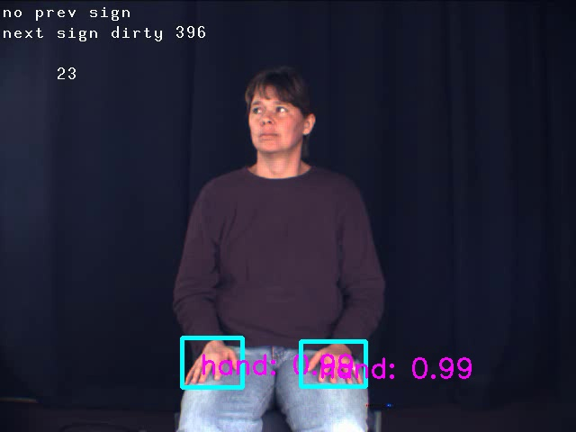

# Light-Ｈand-Detector


- Support for onnx video inference.

## Tested the environment that works
- Ubuntu16.04
- Python3.7
- onnx1.6.0
- onnxruntime1.2
- CUDA10.0 + CUDNN7.6

## 

```Python
python webcam_hand.py
```

##  Reference
- [Ultra-Light-Fast-Generic-Face-Detector-1MB](https://github.com/Linzaer/Ultra-Light-Fast-Generic-Face-Detector-1MB)
- [pytorch-ssd](https://github.com/qfgaohao/pytorch-ssd)
- [RFBNet](https://github.com/ruinmessi/RFBNet)
- [Retinaface](https://github.com/deepinsight/insightface/blob/master/RetinaFace/README.md)
